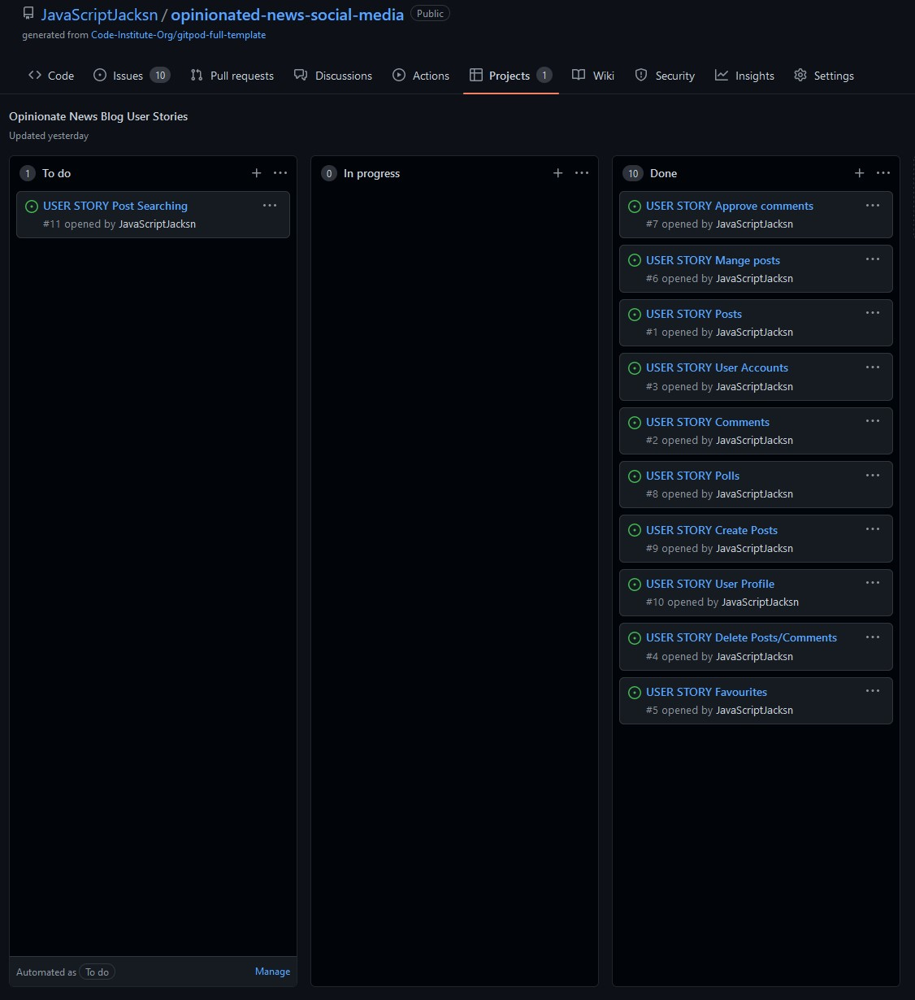

# Opinionate the *Unopinionated*

A social media site for those *wanting* to hear opinions on news and posts from around the world.

- [Optionate the Unopinionated]()

## Introduction

Opinionated the *Unopinionated* is a social media/blogging application that is made for users that wish to leave any or all sorts of opinions on news stories or current events that in the mainstream are left 'unopinionated".

The project itself extends the Code Institute base Codestar blog with full credit given to the features and inspiration taken from the blog app. From a solid foundation of a data models of posts and comments with like functionality, Opinionate extends this further with a poll feature and the added ability for users to create, edit, draft and publish their own posts and polls through forms that are viewable from a new 'My posts' page.

On the creation of a post, users are prompted to chose whether or not they wish to add a 4-option voting poll attached to their post. Any authenticated user may create and vote on polls. With any changes made to the poll wiping the current votes to ensure no manipulation of gathered informtion.

On the original base project, comments were left to be authenticated by an admin and this has been left as a feature whilst posts and polls can be published without authorisation. This is by design as with most social media/blogging applications this is the standard. However often comments are the main source of unwanted activity and usually require a karma/experience level to create, therefore on this site they still require authorisation from an admin as such a system is not implemented.

The site features full CRUD functionality for both users and admins, a feature newly added. Users can edit their posts and their respective polls (if applicable) by clicking the 'Edit' button on the desired posts on the 'My Posts' page.

## Features and Instructions for use

On first entry to the site, users are presented with the 'feed' main page to view all posts

By clicking on a post, users can view the whole post information, including any comments or poll that relates to the post

Users can vote on polls and leave comments on posts once logged in.

Users can log in from the navivagtion link to the Django aullauth account forms

After authentication, full application functionality is unlocked and users can vote on polls and comment on posts

Authenticated users can create posts using the 'Post your opinion' button on the feed page

After creating a post, whether a draft or published, user are promted to chose whether to add a poll or not.

If users 'skip adding a poll' they can always add one at a later date through the edit forms. 

Users can at any time view their posts published or drafts under the 'My Posts' section in the navigation bar once logged in

Clicking 'delete' will prompt a browser alert window to show asking for confirmation before executing the deletion from the database

Clicking 'edit' will open the edit form for the post

After submitting changes (if any) users are taken to the edit poll form, or prompted to create one if one does not exist. 

Users can skip these sections and are not foriced into adding polls if they do not wish to. If a poll is changed, all votes are reset as to ensure user's votes are not misinterpreted or tampered with.

## Planning

From the start the application built upon the codestart blog's solid foundations and aimed to improve it from a user-interactivity side. In the planning stage, the functionality for everyday site users was the main priority. Intially I played sround with the ideas of a scrolling feed, however it became impractical without search functions. Therefore as the planning went on, the app became focused around short-term and current stories, with post search and greater access to older posts being less of a priortiy.

### Database Model Diagram

Ahead of development, this was the schema plan I had layed out. Intially it was on pen and paper, so this image is a post-development example of my planning. The only differences between my first planning and this updated image is the inclusion of the Django allauth fields and how they link into my own database schema.

### Wireframes

Initially the wireframes started around the scrolling feed idea as mentioned before. However going into development this was the wireframe used as my front end guide.

This main wireframe was used to aid in scaling and develpoment of the main pages of the 'Feed' and 'My Posts'.

The other pages were simple enough to conform to the user expectaions developed from seeing these main pages inline with UX principles and I felt did not require too much additional wireframing.

### Use of Agile methodologies

During the development of this prooject, Agile methodoliges were implemented with the aim of exposing myself to actual application of the theory behind Agile, which I found to be greatly improving of my overall development efficiency and decison making.

### Agile changes made in development

I found myself spending too much time on the front-end development at the beginning of the project before even starting the database back-end. I realised this was a mis-prioritsation of my agile sprints and decdied to focus on feature user stories and come back to the front end at the end of the project.

In the image of the kanban below, you can see that the previously mentioned post search functionality was left as a future feature to implement. It was also intially part of the wireframe above, but was de-prioritised during development.

### Final thoughts on Agile

Personally, I found that the Agile methodolgy aspect of 'Responding to change over following a plan' was incredibly intesting as I found it to be used alot more than I was expecting and in retrospect with other projects how often its used as a developer even in a casual/hooby development environment.

## Testing

### Validator testing

All HTML pages were validated using the [W3C Validator](https://validator.w3.org/nu/?doc=https%3A%2F%2Fopinionate-the-unopinionated.herokuapp.com%2F)

All custom HTML has no errors or warnings. However, the pages where summernote fields were generated from the database (E.g. post-detail.html) the rendering html did cause several errors outside of my control.

All CSS was validated with no errors or warnings with the [W3C Jigsaw validator](https://jigsaw.w3.org/css-validator/validator)

All Python was [PEP8](http://pep8online.com/) validated with no errors or warnings.

Chrome lighthouse results

### Manual tests completed

- As a Site User I can create posts so that I can share my stories on the site.
    - Users on all screen sizes can view posts on the feed.
    - Users can navigate the site with ease and with good UX.
- As a Site User I can comment on posts so that I can leave my opinion and start discussions.
    - Once authenticated users can view the comment inline form at the bottom of posts.
    - Users can submit comments for approval.
    - Users get a visual response from the site explaining their comment is awaiting approval.
- As an Admin I can approve comments so that harmful or unwanted comments are not shown to users.
    - All comments in response to posts are held as unapproved before viewable on the site.
    - Through the admin panel using superuser login credentials, admins can approve/delete comments.
    - Approved comments show on the comment feed below posts.
- As an Admin I can manage posts so that I can remove posts that go against the site rules.
    - Through the admin panel using superuser login credentials, admins can remove and change the status of posts.
    - Admins can delete posts, polls and comments through the admin panel.
- As a Site User and Admin I can create an account so that I can access the right level fo authentication and access to the sites functionality.
    - Users can create and save an account credentials.
    - Admins can create and save superuser account credentials.
    - Users's accounts cannot access any admin functionality.
    - Users cannot access any content that requires authentication without logging in first. 
- As a Site User I want to be able to vote and view polls, so I can gain a glance view of the general opinions on a question to better interact with other site users.
    - Users can view polls at the bottom of post's detailed view if the post has an attached poll.
    - Users cannot vote unless authenticated.
    - Users, once authenticated can vote on polls through the poll form by clicking the 'vote' button.
    - The question, options, results and total votes are displayed to all users, authenticated or not.
- As a Site User, I want to be able to create posts and polls so that other users may view my activity, so I can initiate discussions with other users of the site.
    - Users, once authenticated, can create posts using the 'Post your opinion' button on the feed page.
    - Users are prompted after submitting a post creation form to add a poll, or skip adding a poll.
    - Posts with 'Draft' status are viewable only in the 'My Posts' page for themselves only.
    - Posts with 'Published' status are posted and viewable to all users on the 'Feed' page.
    - Polls appear at the bottom of posts and are viewable whereever a detailed post view is avaliable (On the 'Feed' page for published related posts, or the My 'Posts' page for draft related posts)
- As a Site User, I want to be able to view my posts so I can easily view my posts and their status and manage them effectively.
    - Users, once authenticated, can view their posts under the 'My Posts' page linked in the navigation bar.
    - Users can view their posts in order of the date they were created on similarly to the 'Feed' page.
    - Users can view the options to 'Edit' or 'Delete' posts.
- As a Site User, I want to be able to edit posts and polls so that I can change the published/draft status or change the content of posts/polls.
    - Users can use the 'Edit' button on the 'My Posts' page to edit selected posts.
    - Users can only edit posts or polls that they themselves/their account created.
    - Users are prompted to edit their poll after submitting a changedor unchanged post edit form.
    - If no poll exists, users are asked if they would like to add one to their post.
- As a Site User I can delete posts and polls so that the site remains free of unwanted, harmful or erroneous posts.
    - Users can use the 'Delete' option on posts on the 'My Posts' page to delete posts.
    - Users are prompted via browser alert to confirm their decsion so accidental deletion of posts does not occour.

### Bugs

#### Solved

- Edit forms were not loading the correct instance into the prepoulated fields.
    - Solved as test posts created in the admin panel shared the same titles/slugs.
- Posts did not generate slugs properly from the title.
    - Solved by making post titles unique (Not used as a PK, as spaces caused issues in urls).
- The URL configurations with the use of slugs and overlapped in pattern and were matched multiple times causing HTTP errors.
    - Solved by adding an extra url /blog_app/ pattern to distinguish between overlapping urls.
- HTML pages were not full-height and the footer raised up on shorter account related pages.
    - Solved by adding html and body height and min-height values to the Django account pages templates.

#### Existing

- CSS
    - On the 'My Posts' page, the two inline forms for the 'Edit' and 'Delete' options are not aligned together.
- Django Summernote
    - On the post creation and editing forms the Django Summernote field is fixed in size.
    - Whislt this does not break functionality, on smaller viewports it may require horizontal scrolling to view all Summernote text options

## Deployment / Security Issues

### **IMPORTANT AKNOWLEDGEMENT**

At the start of the project, during an intial deployment to Heroku, the secret key was pushed to the project's public GitHub repository.

It was just a simple mistake of overlooking the basics, however I resloved this issue by removing the key and changing it's value.

Thanks to the security at GitHub and Git Guardian, along with adivce from my mentor, this issue was dealt with and now the application is secure and has no risks going into final deployment.

- Intial deployment
    - Initial commit after initialising the Django project
    - Linked Heroku app to the GitHub repository
    - Clicked 'Deploy branch' under the 'Manual deploy' header
    - Config vars were set for:
        - Port
        - Disable collect static
        - Database URL
        - Cloudinary URL
        - Secret Key (new one after security leak)
    - The application was deployed early into development to ensure services on  heroku and the postgres database was working
    - This ensured little issues were encountered at later stages of deployment
    Config vars for secret keys and database URLs were established
- Final deployments
    - DEBUG was set to False in Django settings
    - Disable collect static was removed

## Final Thoughts

This project has really shown me the beauty of batteries-included frameworks like Django that connect front-end and back-end technologies so well. The sheer amount of processes abstracted behing simple classes and methods really made creating a Full Stack application straight forward (for the most part...).

Furthermore, the use of the Model View Controller (or Template) design pattern was fantastic to use and is to me now, an understanably great and effective design pattern to use for web applications such as this. Throughout this project, I have learned more about software development than at any time previously. It showed me how I overlooked the importance and great help of planning how a project is to be constructed and  developed. This project has been a great milestone in my development career and I look forward to bringing what I have learnt, the good and the hard into my future projects.
